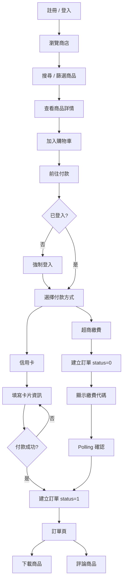

# Digital Vault 🛍️

> 數位商品電商平台 — 即購即用，無需等待配送

---

## 專案成員

| 成員 | 負責範圍 |
|---|---|
| Wu | 前端（React）、後端（.NET 8 WebAPI） |
| Amy | 後端（.NET 8 WebAPI）、資料庫設計 |

---

## 技術架構

### 前端
- **框架**：React 19 + Vite
- **路由**：React Router v7（懶加載 + 巢狀路由）
- **狀態管理**：Context API（UIContext / AuthContext / CartContext）
- **HTTP**：Axios（含 interceptor 自動刷新 Token）
- **樣式**：純 CSS（CSS Variables，支援 768px / 1920px / 2560px 響應式）

### 後端
- **框架**：.NET 8 WebAPI
- **資料庫**：SQL Server（DigitalVaultStore）
- **ORM**：Entity Framework Core
- **認證**：JWT Bearer + Google OAuth + HttpOnly Cookie + Token 黑名單
- **安全**：RBAC 角色權限控制（Policy）

---

## 環境需求

- Node.js 18+
- .NET 8 SDK
- SQL Server
- Tailscale VPN（跨網路連線資料庫用）

---

## 本地開發設定

### 前端

```bash
cd fonted/digital-vault
npm install
npm run dev
```

前端運行於 `http://localhost:5173`

### 後端

```bash
cd DigitalProject
dotnet restore
dotnet run
```

後端運行於 `https://localhost:7124`

### Vite Proxy 設定

`vite.config.js` 透過 proxy 解決跨域問題：

```js
export default defineConfig({
  plugins: [react()],
  server: {
    port: 5173,
    proxy: {
      '/api': {
        target: 'https://localhost:7124',
        changeOrigin: true,
        secure: false,
      }
    }
  },
})
```

### 環境變數

在前端根目錄建立 `.env`：

```env
VITE_API_URL=http://localhost:5173/api
```

在後端 `appsettings.json` 設定：

```json
{
  "ConnectionStrings": {
    "DbContext": "你的 SQL Server 連線字串"
  },
  "JwtTokenSettings": {
    "Issuer": "DigitalProject",
    "Audience": "DigitalProjectUsers",
    "IssuerSigningKey": "你的密鑰（至少 32 字元）",
    "ExpirationMinutes": "2880"
  },
  "Authentication": {
    "Google": {
      "ClientId": "你的 Google Client ID",
      "ClientSecret": "你的 Google Client Secret"
    }
  }
}
```

---

## 資料庫

### 測試資料

```sql
-- 查詢測試帳號
SELECT Id, Email FROM [DigitalVaultStore].[dbo].[Users];

-- 查詢測試商品
SELECT Id, Name, Price FROM [DigitalVaultStore].[dbo].[Products];
```

### 設定管理員帳號

```sql
UPDATE UserRoles
SET RoleId = (SELECT Id FROM Roles WHERE Code = 'admin')
WHERE UserId = (SELECT Id FROM Users WHERE Email = '你的Email');
```

### 清除殭屍訂單

```sql
DELETE FROM Orders
WHERE Id IN (
  SELECT o.Id
  FROM Orders o
  LEFT JOIN Payments p ON o.Id = p.OrderId
  WHERE o.Status = 0 AND p.Id IS NULL
)
```

---

## API 文件

後端啟動後可至 Swagger 查看完整 API：

```
https://localhost:7124/swagger
```

### 主要端點

| 方法 | 路由 | 說明 | 需要登入 |
|---|---|---|---|
| POST | `/api/auth/register` | 註冊 | ❌ |
| POST | `/api/auth/login` | 登入 | ❌ |
| POST | `/api/auth/logout` | 登出 | ✅ |
| POST | `/api/auth/refresh` | 刷新 Token | ❌ |
| GET | `/api/auth/google` | Google 登入 | ❌ |
| GET | `/api/category` | 取得分類列表 | ❌ |
| GET | `/api/product` | 取得商品列表（支援搜尋、排序、分類篩選） | ❌ |
| GET | `/api/product/:id` | 取得商品詳情 | ❌ |
| GET | `/api/order` | 取得我的訂單 | ✅ |
| PUT | `/api/order/:id/cancel` | 取消訂單 | ✅ |
| GET | `/api/order/:id/download` | 取得下載連結 | ✅ |
| POST | `/api/payment/checkout` | 結帳（建立訂單 + 付款） | ✅ |
| GET | `/api/payment/order/:orderId` | 取得訂單付款紀錄 | ✅ |
| PUT | `/api/payment/:id/cvs-confirm` | 超商繳費確認 | ✅ |
| GET | `/api/review/product/:productId` | 取得商品評論 | ❌ |
| GET | `/api/review/product/:productId/stats` | 取得評論統計 | ❌ |
| POST | `/api/review` | 新增評論（需購買記錄） | ✅ |
| PUT | `/api/review/:id` | 修改評論 | ✅ |
| DELETE | `/api/review/:id` | 刪除評論 | ✅ |
| GET | `/api/user/purchases` | 取得已購商品 | ✅ |
| PUT | `/api/user/displayName` | 修改顯示名稱 | ✅ |
| PUT | `/api/user/password` | 修改密碼 | ✅ |
| PUT | `/api/user/avatar` | 上傳頭像 | ✅ |

### Admin 端點

| 方法 | 路由 | 說明 | 權限 |
|---|---|---|---|
| GET | `/api/admin/stats` | 後台統計數據 | admin |
| GET | `/api/admin/product` | 取得所有商品 | manager |
| POST | `/api/admin/product` | 新增商品 | manager |
| PUT | `/api/admin/product/:id` | 編輯商品 | manager |
| PUT | `/api/admin/product/:id/publish` | 上架商品 | manager |
| DELETE | `/api/admin/product/:id` | 下架商品 | manager |
| GET | `/api/admin/category` | 取得所有分類 | manager |
| POST | `/api/admin/category` | 新增分類 | manager |
| PUT | `/api/admin/category/:id` | 編輯分類 | manager |
| DELETE | `/api/admin/category/:id` | 刪除分類 | manager |
| GET | `/api/admin/order` | 取得所有訂單 | support |
| PUT | `/api/admin/order/:id/status` | 更新訂單狀態 | support |
| GET | `/api/admin/payment` | 取得所有付款記錄 | support |
| PUT | `/api/admin/payment/:id/void` | 作廢付款 | support |
| GET | `/api/admin/user` | 取得所有用戶 | admin |
| PUT | `/api/admin/user/:id/role` | 更新用戶角色 | admin |
| PUT | `/api/admin/user/:id/activate` | 啟用帳號 | admin |
| PUT | `/api/admin/user/:id/deactivate` | 停用帳號 | admin |
| GET | `/api/admin/review` | 取得所有評論 | support |
| DELETE | `/api/admin/review/:id` | 刪除評論 | support |

---

## 付款流程

### 新流程（使用 `/api/payment/checkout`）

```
信用卡：
選擇信用卡 → 填寫卡片資訊 → 付款成功 → 建立訂單（status=1）

超商：
選擇超商 → 建立訂單（status=0）→ 取得繳費代碼 → 去超商繳費 → status=1
```

### 信用卡測試

- 卡號末四碼非 `0000` → 付款成功
- 卡號末四碼為 `0000` → 付款失敗（不建立訂單）

---

## RBAC 角色權限

| 角色 | 說明 | 可存取後台 |
|---|---|---|
| `user` | 一般使用者 | ❌ |
| `manager` | 商品管理員 | 商品、分類管理 |
| `support` | 客服人員 | 訂單、付款、評論管理 |
| `admin` | 系統管理員 | 全部 |

> 角色為小寫，多角色用逗號分隔，例如 `admin,manager`

---

## 測試流程

### 1. 註冊 / 登入
- 前往首頁點「登入 / 註冊」
- 填寫 Email、顯示名稱、密碼完成註冊
- 或使用 Google 帳號登入

### 2. 瀏覽商店
- 點導覽列「商店」
- 可依分類篩選、關鍵字搜尋、價格排序
- 點商品進入詳情頁

### 3. 加入購物車
- 在商品詳情頁點「加入購物車」
- 訪客也可加入，結帳時才需要登入
- 點導覽列「🛒 購物車」查看購物車

### 4. 前往付款

| 付款方式 | 說明 |
|---|---|
| 信用卡 | 填寫卡號、持卡人、有效期限、CVV，付款成功才建立訂單 |
| 超商繳費 | 先建立訂單取得繳費代碼，系統自動 polling 確認 |
| ECPay / LinePay | 即將推出 |

### 5. 訂單管理

| 操作 | 條件 |
|---|---|
| 查看繳費代碼 | 超商未付款訂單 |
| 取消訂單 | 狀態為「未付款」 |
| 下載商品 | 狀態為「已付款」或「已完成」 |
| 評論商品 | 狀態為「已付款」或「已完成」 |

### 6. 評論商品
- 從訂單頁點「💬 評論商品」
- 或從商品詳情頁下方評論區撰寫
- 需要有購買記錄才能評論
- 自己的評論可以編輯和刪除

### 7. 會員中心
- 點右上角頭像進入會員中心
- 個人資料：修改顯示名稱、查看帳號資訊
- 帳號安全：修改密碼
- 已購商品：查看所有購買記錄
- 我的訂單：跳轉至訂單頁

### 8. 後台管理（需要 manager 以上角色）
- 前往 `/admin` 進入後台
- 左側 Sidebar 依角色顯示可用功能
- 商品管理：新增、編輯、上架、下架商品
- 分類管理：新增、編輯、刪除分類
- 訂單管理：查看所有訂單、更新狀態
- 付款管理：查看付款記錄、作廢付款
- 用戶管理：查看用戶、更新角色、啟用 / 停用帳號
- 評論管理：查看、刪除不當評論

---

## 測試流程圖



---

## 前端目錄結構

```
src/
├── components/
│   ├── layout/         Header.jsx, Footer.jsx, AdminLayout.jsx
│   ├── ui/             Stars.jsx, Toast.jsx, EmptyState.jsx, PageStatus.jsx
│   │                   SkeletonCard.jsx, SkeletonGrid.jsx, SkeletonOrderCard.jsx
│   ├── product/        ProductCard.jsx, ProductGrid.jsx, ProductSearch.jsx
│   ├── modal/          LoginModal.jsx, CheckoutModal.jsx, OrderReviewModal.jsx, DownloadModal.jsx
│   ├── payment/        PaymentMethodList.jsx, CreditCardForm.jsx, CVSResult.jsx
│   │                   PaymentAction.jsx
│   ├── profile/        AvatarUpload.jsx, EditDisplayName.jsx, EditPassword.jsx, PurchaseList.jsx
│   ├── review/         ReviewCard.jsx, ReviewForm.jsx, ReviewSection.jsx
│   ├── admin/
│   │   ├── product/    ProductTable.jsx, ProductFormModal.jsx
│   │   ├── category/   CategoryTable.jsx, CategoryFormModal.jsx
│   │   ├── payment/    VoidPaymentModal.jsx, VoidDetailModal.jsx, PaymentAction.jsx
│   │   └── review/     ReviewTable.jsx
│   └── pages/
│       ├── HomePage.jsx, StorePage.jsx, DetailPage.jsx
│       ├── CartPage.jsx, OrdersPage.jsx, ProfilePage.jsx, AuthCallback.jsx
│       ├── AdminPage.jsx, AdminProductPage.jsx, AdminCategoryPage.jsx
│       ├── AdminOrderPage.jsx, AdminPaymentPage.jsx
│       ├── AdminUserPage.jsx, AdminReviewPage.jsx
│       └── ProtectedRoute.jsx
├── context/
│   ├── UIContext.jsx    toasts, loginOpen, checkoutOpen
│   ├── AuthContext.jsx  user, loginAs, logout, isGuest
│   └── CartContext.jsx  sessionCart, addToCart, removeFromCart, checkout
├── hook/
│   ├── useAuthForm.js        handleLogin, handleRegister
│   ├── useProduct.js         useProducts, useCategories, useProductDetail
│   ├── useOrders.js          useMyOrders, useCancelOrder, useDownload, useOrderIdByProduct
│   ├── useProfile.js         usePurchases, useUpdateDisplayName, useUpdatePassword
│   ├── useReview.js          useProductReviews, useReviewActions
│   ├── useCheckout.js        付款流程
│   ├── useAdminProducts.js   後台商品管理
│   ├── useAdminCategories.js 後台分類管理
│   ├── useAdminOrders.js     後台訂單管理
│   ├── useAdminPayments.js   後台付款管理
│   ├── useAdminUsers.js      後台用戶管理
│   ├── useAdminReviews.js    後台評論管理
│   └── useAdminStats.js      後台統計數據
├── utils/
│   ├── ApiFunction.js     所有 API 呼叫
│   ├── axiosInstance.js  Axios 實例 + Token 自動刷新 interceptor
│   ├── authEvents.js     Token 刷新事件系統
│   ├── tokenHelper.js    USER_KEY，user 資訊存取
│   ├── roleHelper.js     hasRole, isAdmin, isManager, isSupport
│   └── avatarHelper.js   getAvatarUrl，處理相對路徑頭像
├── styles/
│   └── profile.css       Profile 頁面獨立樣式
├── App.jsx               懶加載路由 + Provider 層
├── main.jsx
└── index.css
```

---

## 注意事項

- `.env` 和 `appsettings.json` 不應提交到 Git
- Google OAuth Callback URL 需在 Google Cloud Console 設定為 `https://localhost:7124/signin-google`
- 跨網路連線資料庫需要開啟 Tailscale VPN
- 後台需要 `manager` 以上角色才能進入，可透過 SQL 設定角色
- 頭像儲存於後端 `wwwroot/uploads/avatars/`，部署時需確認資料夾有寫入權限
