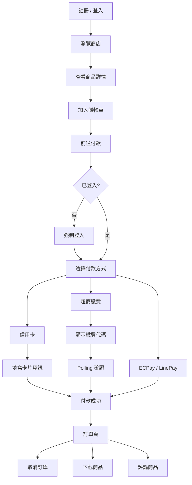

# React + Vite

```mermaid
flowchart TD
    A[註冊 / 登入] --> B[瀏覽商店]
    B --> C[查看商品詳情]
    C --> D[加入購物車]
    D --> E[前往付款]
    E --> F{已登入?}
    F -- 否 --> G[強制登入]
    G --> H[選擇付款方式]
    F -- 是 --> H
    H --> I[ECPay / LinePay]
    H --> J[信用卡]
    H --> K[超商繳費]
    J --> J1[填寫卡片資訊]
    J1 --> L[付款成功]
    K --> K1[顯示繳費代碼]
    K1 --> K2[Polling 確認]
    K2 --> L
    I --> L
    L --> M[訂單頁]
    M --> N[取消訂單]
    M --> O[下載商品]
    M --> P[評論商品]
```
