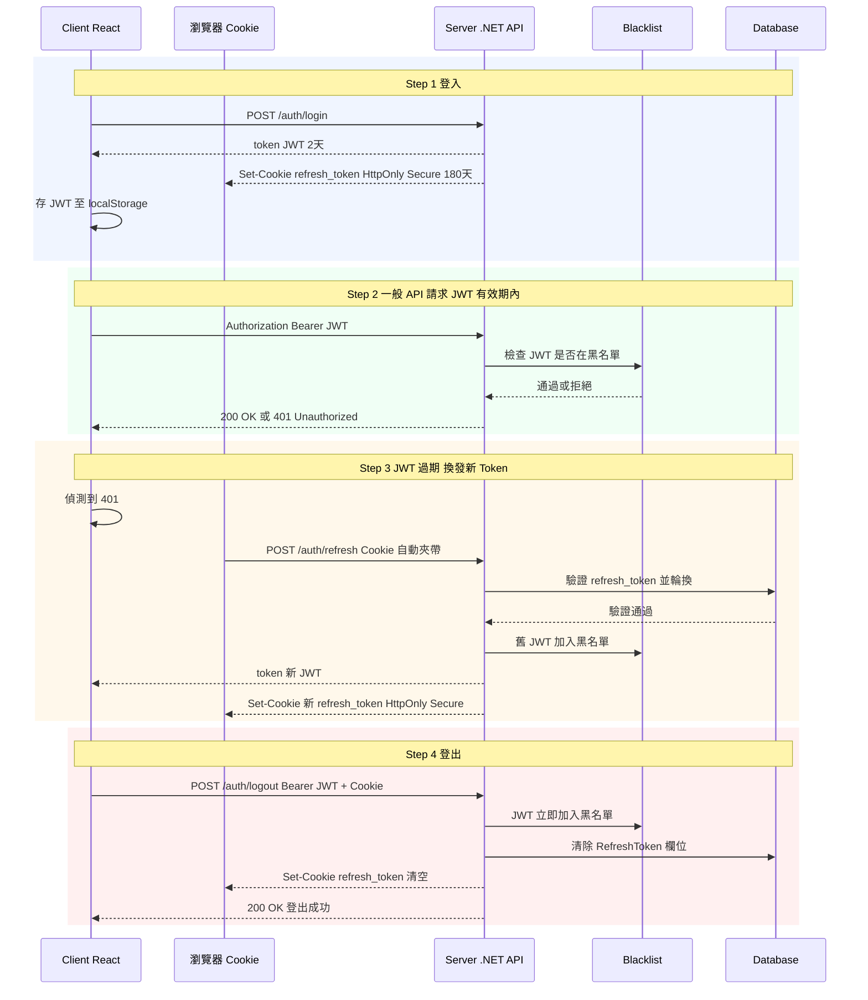

```mermaid
sequenceDiagram
    participant C as Client React
    participant B as 瀏覽器 Cookie
    participant S as Server .NET API
    participant BL as Blacklist
    participant DB as Database

    rect rgb(240, 245, 255)
        Note over C,DB: Step 1 登入
        C->>S: POST /auth/login
        S-->>C: token JWT 2天
        S-->>B: Set-Cookie refresh_token HttpOnly Secure 180天
        C->>C: 存 JWT 至 localStorage
    end

    rect rgb(240, 255, 245)
        Note over C,DB: Step 2 一般 API 請求 JWT 有效期內
        C->>S: Authorization Bearer JWT
        S->>BL: 檢查 JWT 是否在黑名單
        BL-->>S: 通過或拒絕
        S-->>C: 200 OK 或 401 Unauthorized
    end

    rect rgb(255, 248, 235)
        Note over C,DB: Step 3 JWT 過期 換發新 Token
        C->>C: 偵測到 401
        B->>S: POST /auth/refresh Cookie 自動夾帶
        S->>DB: 驗證 refresh_token 並輪換
        DB-->>S: 驗證通過
        S->>BL: 舊 JWT 加入黑名單
        S-->>C: token 新 JWT
        S-->>B: Set-Cookie 新 refresh_token HttpOnly Secure
    end

    rect rgb(255, 240, 240)
        Note over C,DB: Step 4 登出
        C->>S: POST /auth/logout Bearer JWT + Cookie
        S->>BL: JWT 立即加入黑名單
        S->>DB: 清除 RefreshToken 欄位
        S-->>B: Set-Cookie refresh_token 清空
        S-->>C: 200 OK 登出成功
    end
```
